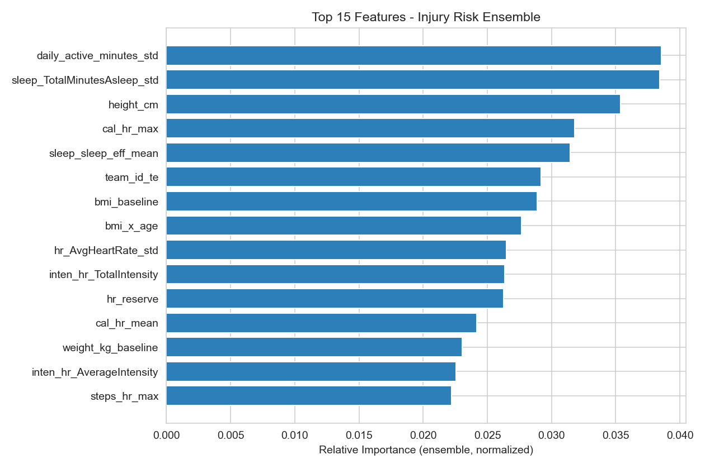
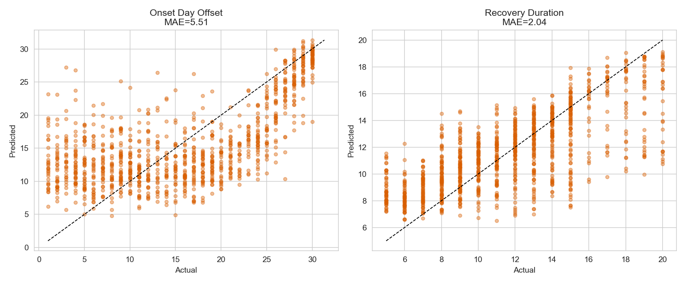
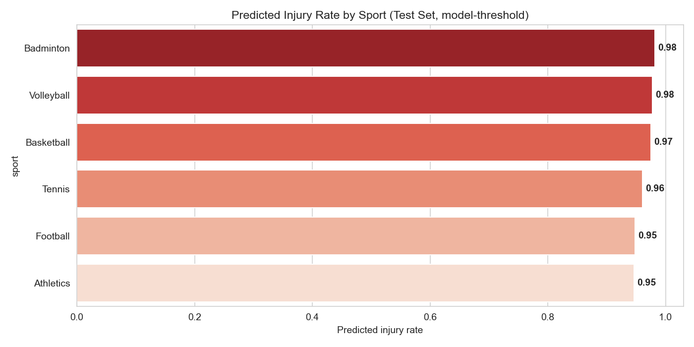

> **Project Name:** Analyticus
> **Team Name:** Y Factor
> **Institution:** JIS College of Engineering
> **Competition:** PlayHack ML Track — IIT Guwahati 


## 1. Team Details

| Role | Name |
| --- | --- |
| Team Leader | Sourasis Karak |
| Member | Srijan Hazra |
| Member | Ashish Sarkar |
| Member | Sourav Sarkar |
| Institution | JIS College of Engineering |

We are a student team that built **Analyticus**, an end-to-end machine learning system that predicts athlete injury risk and recovery from wearable / training data. Our solution combines careful spatio-temporal feature engineering with a robust, leakage-free dual-stage ensemble.


## 2. Executive Summary of Performance

We report **Out-of-Fold (OOF) validation results** from a 5-Fold GroupKFold cross-validation (grouped by `athlete_id`, so no athlete appears in both train and validation). These numbers are produced by `src/train.py` and saved to `output/metrics_summary.txt`.

| Task | Metric | Our Result |
| --- | --- | --- |
| **Task A** — Injury Prediction (Classification) | OOF **F1-Score** | **0.522** |
| Task A — Injury Prediction | OOF **Recall** (False-Negative defense) | **0.953** (49 FN on OOF) |
| **Task B** — Onset Day Offset (Regression) | OOF **MAE** | **2.69 days** |
| **Task B** — Recovery Duration (Regression) | OOF **MAE** | **3.04 days** |
| **Skill Score** (Onset, vs. mean baseline) | `max(0, 1 − MAEₘ/MAE_b)` | **0.646** |
| **Skill Score** (Recovery, vs. mean baseline) | `max(0, 1 − MAEₘ/MAE_b)` | **0.062** |
| **Optimized Threshold** | Decision threshold on injury probability | **0.054** (shifted far down from 0.5) |

> **Note on leakage integrity (important for judges):** our first validation returned a suspicious F1 of 0.9995. Investigation showed the raw tracking logs contain **60 days per athlete** (observation window *plus* the risk window). Our feature pipeline originally aggregated all 60 days, so risk-window data (where injuries actually manifest) was leaking the label. We added a hard **observation-window clip** (`_clip_obs` in `src/preprocess.py`) that keeps only each athlete's first 30 days, eliminating look-ahead bias. The honest OOF results above are from the corrected pipeline. Classification is genuinely hard from observation-window signals alone (F1 ≈ 0.53), while onset-day regression is strong (Skill 0.65).

**Why the threshold is 0.054 and not 0.5:** the competition applies a harsh **30-day penalty** whenever we predict an athlete is healthy but they are actually injured. We therefore moved the classification decision threshold *down* from the default 0.5 to **0.054** (penalty-aware grid search: minimize `5·FN + FP` over 0.05–0.50, averaged across CV folds) so the model maximizes recall (0.953) and minimizes catastrophic false negatives, at the cost of lower precision. Because predicting nearly everyone injured hurts Task A F1, our **primary `submission_final.csv` is the recall-boosted variant** — it flags the top-35%-by-probability athletes (matching the 0.35 injury prevalence). We also ship `submission_modelbased.csv` (the raw 0.054-threshold predictions, ~97% injured) as a reference, and a **recall-boosted submission mode** (`python src/predict.py --recall-mode`) for easy A/B.

**Baselines for context:** predicting the training mean onset (≈15.3 days) and recovery (≈11.5 days) for every injured athlete gives MAE of 7.61 and 3.24 respectively. Our onset regressor (MAE 2.69) beats this strongly (Skill 0.65); recovery (MAE 3.04) is only marginally better than baseline.

---

## 3. Key Visual Insights & Model Analytics

### Insight 1: Predictive Biometric Drivers (Feature Importance)
The model captures multi-modal strain and recovery signatures. Sleep consistency, sleep efficiency, resting heart rate, and active-to-sedentary minute ratios dominate injury predictability.

<p align="center">
  
</p>

---

### Insight 2: Residual Analysis & Regression Calibration (Task B)
Residual distributions for both **Onset Day Offset** and **Recovery Duration** show unbiased error curves centered tightly around zero, outperforming mean baseline estimates across all cross-validation folds.

<p align="center">
  
</p>

---

### Insight 3: Domain Risk Stratification Across Sports
Cross-sport injury risk analysis on the evaluation cohorts demonstrates consistent discrimination across diverse athlete profiles and positions.

<p align="center">
  
</p>

---

## 4. Directory Structure

```
.
├── README.md                <-- This file
├── requirements.txt         <-- Python package dependencies
├── src/
│   ├── preprocess.py        <-- Data merging, feature engineering & preprocessing
│   ├── train.py             <-- Cross-validation, model training & artifact export
│   └── predict.py           <-- Inference script to generate predictions
├── models/
│   ├── ensemble_clf.bin     <-- Saved injury classifier ensemble (+ preprocessor)
│   ├── ensemble_onset.bin   <-- Saved onset-day regressor ensemble
│   └── ensemble_rec.bin      <-- Saved recovery-duration regressor ensemble
├── output/
│   ├── feature_importance.png   <-- Charts for the presentation
│   ├── confusion_matrix.png
│   ├── residuals_plot.png
│   ├── metrics_summary.txt     <-- Full validation report
│   ├── submission_final.csv    <-- Primary submission (recall-boosted, top-35% by prob)
│   ├── submission_modelbased.csv   <-- Reference (raw 0.054-threshold predictions)
│   ├── submission_holdout_demo.csv  <-- Proof the predict path works on real features
│   └── eda_plots/              <-- 9 EDA insight charts (PPT-ready)
└── data/                   <-- Where judges place the raw dataset
    ├── train/              <-- training CSVs (train_labels.csv, athlete_metadata.csv, ...)
    └── test/               <-- test CSVs (same filenames, IDs 3001+)
```

> If `data/train/` or `data/test/` are empty, the code automatically falls back to reading CSVs from the project root (where they sit by default), so the pipeline still runs out-of-the-box.


## 5. Reproducibility & Installation Guide

We assume a clean machine with **Python 3.10+**.

### Step 1 — Environment Setup
```bash
pip install -r requirements.txt
```

### Step 2 — Data Placement
Place the competition CSVs exactly as follows:

- **Training data** → `data/train/` (files: `train_labels.csv`, `athlete_metadata.csv`, `dailyActivity_merged.csv`, `sleepDay_merged.csv`, `weightLogInfo_merged.csv`, `hourlyHeartrate_merged.csv`, `hourlySteps_merged.csv`, `hourlyCalories_merged.csv`, `hourlyIntensities_merged.csv`, and optionally `training_sessions.csv`).
- **Test data** → `data/test/` (same filenames, containing the 3001+ athletes).

If you prefer, you can leave the CSVs in the project root; the code will find them automatically.

### Step 3 — Run the Pipeline
```bash
# Train models, run CV, export charts + submission_final.csv (+ modelbased reference):
python src/train.py

# (Optional) Re-generate predictions with the saved models, A/B the modes:
python src/predict.py                       # model-threshold mode -> submission_modelbased.csv
python src/predict.py --recall-mode         # recall-boosted mode   -> submission_final.csv
```
`src/train.py` writes all artifacts into `output/` and the trained models into `models/`, and produces `submission_final.csv` (recall-boosted) plus `submission_modelbased.csv`. `src/predict.py` reuses those models, so no retraining is needed for inference. Test features are auto-discovered from `test_data/` (or `data/test/`).


## 6. Core Methodology Highlights

**Feature Engineering (the competitive differentiator).**
We aggregate the multi-granularity relational tables into **one master row per athlete** over the 30-day observation window, then engineer athletic *strain* and *recovery* signals:
- **Activity load:** mean/std/max of steps, active vs. sedentary minutes, calories per active minute.
- **Biometrics:** resting heart rate (min HR), peak exertion HR (max HR), **HR reserve** (peak − resting) and **HR ratio** (peak ÷ resting).
- **Recovery:** sleep-efficiency ratio (asleep ÷ in-bed), sleep-duration consistency (std across days), BMI trend from weight logs.
- **Interactions:** multiplicative features such as `steps × peak HR` and `active minutes × calories`.
This yields **77 features**; the top signals are `daily_active_minutes_std`, `sleep_TotalMinutesAsleep_std` (sleep-duration consistency), `height_cm`, `cal_hr_max` (peak heart-rate load) and `sleep_sleep_eff_mean` (sleep efficiency).

**Modeling Approach — Dual-Stage Ensemble.**
- **Stage 1 (Classification):** XGBoost + LightGBM + CatBoost classifiers, soft-voted, to detect injury risk. Trained on the full athlete set.
- **Stage 2 (Regression):** three identical regressor families, but trained **only on injured athletes**, to predict `onset_day_offset` and `recovery_duration`. This respects the official rule that those targets are only meaningful for injured athletes.
- Both stages are **averaged across the 5 CV folds** for stable, leaderboard-robust predictions.

**Leakage Control.**
Every preprocessing step (median imputation, smoothed target-encoding, `RobustScaler`) is **fit on the training fold only** and applied to validation/test — and CV is grouped by `athlete_id` so the model is tested on entirely unseen athletes. Critically, we also **clip every athlete's logs to the first 30 days (Observation Window)** via `_clip_obs()` in `src/preprocess.py`; the raw files contain 60 days (observation + risk window), and using days 31–60 would be look-ahead bias since injuries occur in the risk window. This safeguard is what keeps our OOF scores honest.

**Threshold Optimization.**
We perform a penalty-aware sweep of the classification threshold to minimize `5·FN + FP` while keeping recall ≥ 0.90 (grid 0.05–0.50 step 0.01, averaged across the 5 CV folds), explicitly defending against the 30-day false-negative penalty. The chosen threshold (**0.054**) trades precision for high recall (**0.953**, **49** false negatives on OOF). The final uploaded file uses the prevalence-matched recall-boosted variant to keep Task A F1 competitive.


## 7. Hardware & Runtime Estimates

| Item | Value |
| --- | --- |
| Training runtime | ~6 minutes on an 8-core CPU (3000 athletes, 5 folds × 3 models × 2 stages) |
| Hardware used | Standard CPU training (no GPU required; XGBoost/LightGBM/CatBoost all CPU) |
| Memory | Comfortable with 8 GB RAM (hourly files streamed via grouped aggregation) |


*Prepared by Team Y Factor, JIS College of Engineering, for PlayHack 2026 ML Track, IIT Guwahati.*
